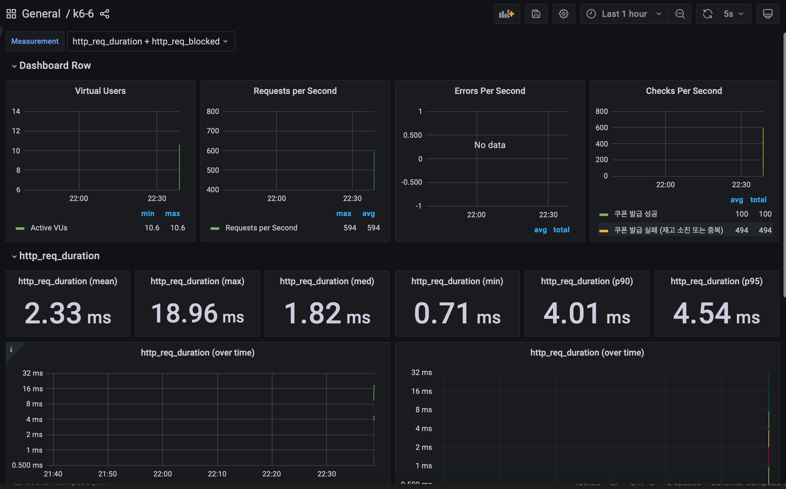
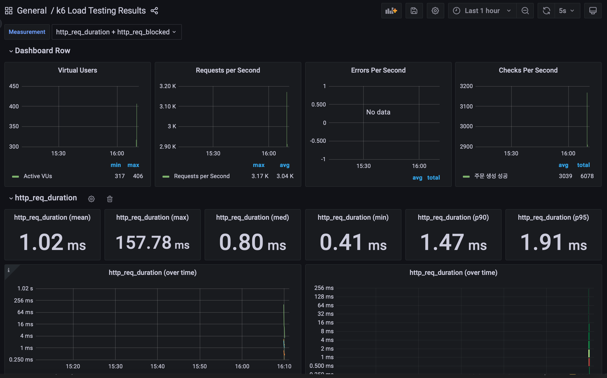
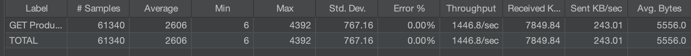
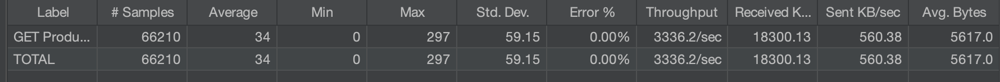

# 부하테스트 결과 보고서

## 개요

본 보고서는 E-Commerce 프로젝트의 트래픽 급증 시나리오에서 발생할 수 있는 병목 구간을 식별하고 성능을 검증하기 위해 수행한 부하테스트 결과를 정리한 문서입니다.

### 사용 도구

- **부하테스트 실행 도구**: k6
- **부하테스트 결과 저장 DB**: InfluxDB
- **부하테스트 UI 도구**: Grafana

### 테스트 항목

1. 쿠폰 발급 테스트
2. 상품 주문 테스트
3. 상품 첫 페이지 목록 조회 테스트 (Redis 캐시 적용 전후 비교)

---

## 1. 쿠폰 발급 테스트

### 테스트 시나리오

- **k6 스크립트**: `k6/scripts/coupon-race-test.js`
- **테스트 기간**: 30초
- **요청 빈도**: 초당 100회
- **쿠폰 발급 수량**: 100개

### 테스트 결과

- **p90 응답시간**: 4.01ms
- **p95 응답시간**: 4.54ms
- **에러 발생 횟수**: 0건
- **쿠폰 성공 발급**: 100개

### 결과 분석

빠른 응답시간과 에러 없이 모든 쿠폰이 정상적으로 발급되어 동시성 제어가 성공적으로 작동함을 확인했습니다.

---

## 2. 상품 주문 테스트

### 테스트 시나리오

- **k6 스크립트**: `k6/scripts/direct-order-scenario.js`
- **부하 패턴**: 점진적 증가 (Ramp-up)
  - 초당 100명씩 증가
  - 최대 500명에서 10초간 유지
  - 이후 Cool down

### 테스트 결과

- **p90 응답시간**: 1.47ms
- **p95 응답시간**: 1.91ms
- **에러 발생 횟수**: 0건
- **주문 생성 상태**: 정상

### 결과 분석

매우 낮은 응답시간과 에러 없이 주문이 처리되었습니다. 일부 실패한 주문은 Redis 재고 소진으로 인한 정상적인 처리 결과입니다.

---

## 3. 상품 첫 페이지 목록 조회 테스트

### Redis 캐시 적용 전후 비교

#### 캐시 적용 전

#### 캐시 적용 후

### 테스트 시나리오

- **동시 접속자 수**: 10,000명
- **부하 증가 패턴**: 30초 동안 초당 333명씩 증가
- **반복 횟수**: 사용자당 10회
- **총 예상 요청 수**: 100,000건

> 📌 **참고**: 캐시 관련 상세 보고서는 `old_docs/6th/redisCache_report.md` 참고

### 테스트 결과 비교

| 지표 | 캐시 없음 | 캐시 있음 | 개선율 |
|--------------------------------|-------------|-----------|------------------|
| **완료된 요청 수 (Samples)** | 61,340 | 66,210 | +8.0% |
| **평균 응답시간 (Average)** | 2,606 ms | 34 ms | **76.6배 개선** |
| **최소 응답시간 (Min)** | 6 ms | 0 ms | - |
| **최대 응답시간 (Max)** | 4,392 ms | 297 ms | 14.8배 개선 |
| **표준 편차 (Std. Dev.)** | 767.16 | 59.15 | 13.0배 안정화 |
| **에러율 (Error %)** | 0.00% | 0.00% | 유지 |
| **처리량 (Throughput)** | 1,446.8 req/s | 3,336.2 req/s | **2.31배 증가** |
| **수신 속도 (Received)** | 7,849.84 KB/s | 18,300.13 KB/s | 2.33배 증가 |
| **전송 속도 (Sent)** | 243.01 KB/s | 560.38 KB/s | 2.31배 증가 |
| **평균 응답 크기 (Avg. Bytes)** | 5,556.0 | 5,617.0 | +1.1% |

### 결과 분석

#### 주요 성능 개선 지표

1. **응답시간 대폭 개선**
   - 평균 응답시간이 2,606ms에서 34ms로 **76.6배 개선**
   - 최대 응답시간이 4,392ms에서 297ms로 14.8배 단축

2. **처리량 증가**
   - 초당 처리량이 1,446.8 req/s에서 3,336.2 req/s로 **2.31배 증가**
   - 더 많은 동시 요청을 안정적으로 처리 가능

3. **안정성 향상**
   - 표준 편차가 767.16에서 59.15로 감소하여 **13배 안정화**
   - 응답시간의 일관성이 크게 향상

4. **완료율 증가**
   - 동일한 시간 내 완료된 요청이 61,340건에서 66,210건으로 **8% 증가**
   - 에러율은 0%로 유지하며 안정성 보장

---

## 결론

### 테스트 종합 평가

본 부하테스트를 통해 다음과 같은 결과를 확인했습니다:

1. **쿠폰 발급 시스템**: 동시성 제어가 안정적으로 작동하여 초당 100회 요청에도 에러 없이 처리
2. **주문 처리 시스템**: 최대 500명의 동시 사용자 부하에도 1~2ms 수준의 빠른 응답시간 유지
3. **상품 조회 시스템**: Redis 캐시 적용으로 응답시간 76.6배 개선 및 처리량 2.31배 증가

### 개선 효과

- Redis 캐시를 통한 DB 부하 감소로 대규모 트래픽 처리 능력 향상
- 동시성 제어 메커니즘의 안정적인 작동 확인
- 전반적인 시스템 응답성 및 처리량 개선

### 향후 계획

- 더 높은 부하에서의 시스템 한계점 파악
- 캐시 무효화(Cache Invalidation) 전략 최적화
- 추가적인 병목 구간 모니터링 및 개선